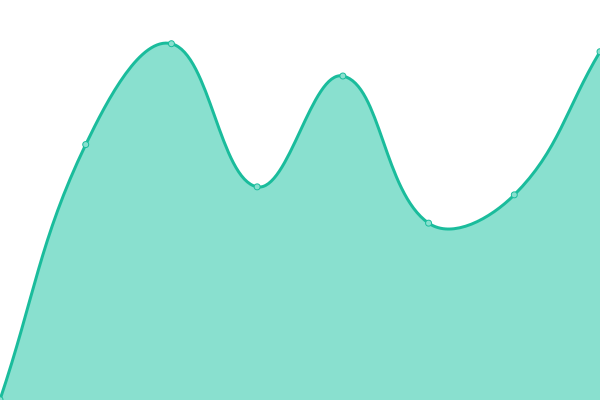
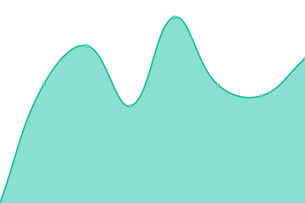
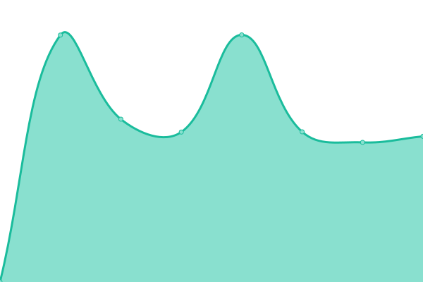

# [📈 Live Status](https://aydgn.github.io/upptime): <!--live status--> **🟧 Partial outage**

This repository contains the open-source uptime monitor and status page for [Aydo르n](https://aydogan.dev), powered by [Upptime](https://github.com/upptime/upptime).

With [Upptime](https://upptime.js.org), you can get your own unlimited and free uptime monitor and status page, powered entirely by a GitHub repository. We use [Issues](https://github.com/aydgn/upptime/issues) as incident reports, [Actions](https://github.com/aydgn/upptime/actions) as uptime monitors, and [Pages](https://aydgn.github.io/upptime) for the status page.

<!--start: status pages-->
<!-- This summary is generated by Upptime (https://github.com/upptime/upptime) -->
<!-- Do not edit this manually, your changes will be overwritten -->
<!-- prettier-ignore -->
| URL | Status | History | Response Time | Uptime |
| --- | ------ | ------- | ------------- | ------ |
|  [Aydo르n](https://aydogan.dev) | 🟩 Up | [aydogan.yml](https://github.com/aydgn/upptime/commits/HEAD/history/aydogan.yml) | 

 170ms
     
 | 

<a href="https://aydgn.github.io/upptime/history/aydogan">100.00%</a>
    

|  [HDI Fiba Emeklilik 캻nternet 룟be](https://internetsube.hdifibaemeklilik.com.tr/) | 🟩 Up | [hdi-fiba-emeklilik-internet-sube.yml](https://github.com/aydgn/upptime/commits/HEAD/history/hdi-fiba-emeklilik-internet-sube.yml) | 

 1084ms
     
 | 

<a href="https://aydgn.github.io/upptime/history/hdi-fiba-emeklilik-internet-sube">100.00%</a>
    

|  [Robert College](https://website.robcol.k12.tr/en/home-page) | 🟩 Up | [robert-college.yml](https://github.com/aydgn/upptime/commits/HEAD/history/robert-college.yml) | 

 1545ms
     
 | 

<a href="https://aydgn.github.io/upptime/history/robert-college">100.00%</a>
    

|  [Bahçıvan Peynir](https://www.bahcivanpeynir.com/) | 🟥 Down | [bahcivan-peynir.yml](https://github.com/aydgn/upptime/commits/HEAD/history/bahcivan-peynir.yml) | 

 1938ms
     
 | 

<a href="https://aydgn.github.io/upptime/history/bahcivan-peynir">64.52%</a>
    

|  [Casa Lavanda](https://www.casalavanda.com.tr/) | 🟩 Up | [casa-lavanda.yml](https://github.com/aydgn/upptime/commits/HEAD/history/casa-lavanda.yml) | 

 2515ms
     
 | 

<a href="https://aydgn.github.io/upptime/history/casa-lavanda">100.00%</a>
    

|  [칂okya르r Holding](https://www.cokyasarholding.com.tr/) | 🟥 Down | [cokyasar-holding.yml](https://github.com/aydgn/upptime/commits/HEAD/history/cokyasar-holding.yml) | 

 1557ms
     
 | 

<a href="https://aydgn.github.io/upptime/history/cokyasar-holding">99.54%</a>
    

|  [Digizoo](https://www.digizoo.com.tr/) | 🟥 Down | [digizoo.yml](https://github.com/aydgn/upptime/commits/HEAD/history/digizoo.yml) | 

 0ms
     
 | 

<a href="https://aydgn.github.io/upptime/history/digizoo">0.00%</a>
    

|  [Elmas Ye를lo륿u](https://www.elmasyesiloglu.com/) | 🟩 Up | [elmas-yesiloglu.yml](https://github.com/aydgn/upptime/commits/HEAD/history/elmas-yesiloglu.yml) | 

 1344ms
     
 | 

<a href="https://aydgn.github.io/upptime/history/elmas-yesiloglu">100.00%</a>
    

|  [Erdem & Erdem](https://www.erdem-erdem.av.tr/) | 🟩 Up | [erdem-and-erdem.yml](https://github.com/aydgn/upptime/commits/HEAD/history/erdem-and-erdem.yml) | 

 1951ms
     
 | 

<a href="https://aydgn.github.io/upptime/history/erdem-and-erdem">100.00%</a>
    

|  [Erdemir Özmen](https://www.erdemirozmen.com/) | 🟩 Up | [erdemir-oezmen.yml](https://github.com/aydgn/upptime/commits/HEAD/history/erdemir-oezmen.yml) | 

 1692ms
     
 | 

<a href="https://aydgn.github.io/upptime/history/erdemir-oezmen">100.00%</a>
    

|  [Fiba Air](https://www.fibaair.com.tr/) | 🟩 Up | [fiba-air.yml](https://github.com/aydgn/upptime/commits/HEAD/history/fiba-air.yml) | 

 1038ms
     
 | 

<a href="https://aydgn.github.io/upptime/history/fiba-air">100.00%</a>
    

|  [Fiba Faktoring](https://www.fibafaktoring.com.tr/) | 🟩 Up | [fiba-faktoring.yml](https://github.com/aydgn/upptime/commits/HEAD/history/fiba-faktoring.yml) | 

 3647ms
     
 | 

<a href="https://aydgn.github.io/upptime/history/fiba-faktoring">100.00%</a>
    

|  [Fiba Group](https://www.fibagroup.com/) | 🟩 Up | [fiba-group.yml](https://github.com/aydgn/upptime/commits/HEAD/history/fiba-group.yml) | 

 1340ms
     
 | 

<a href="https://aydgn.github.io/upptime/history/fiba-group">100.00%</a>
    

|  [GIG](https://www.gig.com.tr/) | 🟩 Up | [gig.yml](https://github.com/aydgn/upptime/commits/HEAD/history/gig.yml) | 

 1171ms
     
 | 

<a href="https://aydgn.github.io/upptime/history/gig">100.00%</a>
    

|  [Hotel Partner](https://www.hotelpartner.com.tr/) | 🟩 Up | [hotel-partner.yml](https://github.com/aydgn/upptime/commits/HEAD/history/hotel-partner.yml) | 

 940ms
     
 | 

<a href="https://aydgn.github.io/upptime/history/hotel-partner">100.00%</a>
    

|  [캻 Faktoring](https://www.isfaktoring.com.tr/) | 🟩 Up | [is-faktoring.yml](https://github.com/aydgn/upptime/commits/HEAD/history/is-faktoring.yml) | 

 2185ms
     
 | 

<a href="https://aydgn.github.io/upptime/history/is-faktoring">100.00%</a>
    

|  [캻zdemir Enerji](https://www.izdemirenerji.com/) | 🟩 Up | [izdemir-enerji.yml](https://github.com/aydgn/upptime/commits/HEAD/history/izdemir-enerji.yml) | 

 1752ms
     
 | 

<a href="https://aydgn.github.io/upptime/history/izdemir-enerji">100.00%</a>
    

|  [Kariabel](https://www.kariabel.com/) | 🟩 Up | [kariabel.yml](https://github.com/aydgn/upptime/commits/HEAD/history/kariabel.yml) | 

 970ms
     
 | 

<a href="https://aydgn.github.io/upptime/history/kariabel">100.00%</a>
    

|  [Katılım Emeklilik](https://www.katilimemeklilik.com.tr/) | 🟥 Down | [katilim-emeklilik.yml](https://github.com/aydgn/upptime/commits/HEAD/history/katilim-emeklilik.yml) | 

 0ms
     
 | 

<a href="https://aydgn.github.io/upptime/history/katilim-emeklilik">0.00%</a>
    

|  [Maxis GS](https://www.maxisgs.com/) | 🟩 Up | [maxis-gs.yml](https://github.com/aydgn/upptime/commits/HEAD/history/maxis-gs.yml) | 

 1193ms
     
 | 

<a href="https://aydgn.github.io/upptime/history/maxis-gs">100.00%</a>
    

|  [Medistate](https://www.medistate.com.tr/) | 🟩 Up | [medistate.yml](https://github.com/aydgn/upptime/commits/HEAD/history/medistate.yml) | 

 1045ms
     
 | 

<a href="https://aydgn.github.io/upptime/history/medistate">100.00%</a>
    

|  [Melodi](https://www.melodi.com.tr/) | 🟩 Up | [melodi.yml](https://github.com/aydgn/upptime/commits/HEAD/history/melodi.yml) | 

 1747ms
     
 | 

<a href="https://aydgn.github.io/upptime/history/melodi">100.00%</a>
    

|  [Miilux](https://www.miilux.com.tr/) | 🟩 Up | [miilux.yml](https://github.com/aydgn/upptime/commits/HEAD/history/miilux.yml) | 

 4170ms
     
 | 

<a href="https://aydgn.github.io/upptime/history/miilux">97.13%</a>
    

|  [Noas](https://www.noas.com.tr/) | 🟩 Up | [noas.yml](https://github.com/aydgn/upptime/commits/HEAD/history/noas.yml) | 

 960ms
     
 | 

<a href="https://aydgn.github.io/upptime/history/noas">100.00%</a>
    

|  [Obase](https://www.obase.com/) | 🟩 Up | [obase.yml](https://github.com/aydgn/upptime/commits/HEAD/history/obase.yml) | 

 1399ms
     
 | 

<a href="https://aydgn.github.io/upptime/history/obase">100.00%</a>
    

|  [Özersoylar](https://www.ozersoylar.com/) | 🟩 Up | [oezersoylar.yml](https://github.com/aydgn/upptime/commits/HEAD/history/oezersoylar.yml) | 

 729ms
     
 | 

<a href="https://aydgn.github.io/upptime/history/oezersoylar">51.98%</a>
    

|  [Özyasar](https://www.ozyasar.com.tr/) | 🟥 Down | [oezyasar.yml](https://github.com/aydgn/upptime/commits/HEAD/history/oezyasar.yml) | 

 1414ms
     
 | 

<a href="https://aydgn.github.io/upptime/history/oezyasar">98.90%</a>
    

|  [Penta](https://www.penta.com.tr/) | 🟩 Up | [penta.yml](https://github.com/aydgn/upptime/commits/HEAD/history/penta.yml) | 

 1475ms
     
 | 

<a href="https://aydgn.github.io/upptime/history/penta">99.35%</a>
    

|  [Prefus](https://www.prefus.com.tr/) | 🟩 Up | [prefus.yml](https://github.com/aydgn/upptime/commits/HEAD/history/prefus.yml) | 

 1034ms
     
 | 

<a href="https://aydgn.github.io/upptime/history/prefus">100.00%</a>
    

|  [Satem Grup](https://www.satemgrup.com.tr/) | 🟩 Up | [satem-grup.yml](https://github.com/aydgn/upptime/commits/HEAD/history/satem-grup.yml) | 

 1078ms
     
 | 

<a href="https://aydgn.github.io/upptime/history/satem-grup">100.00%</a>
    

|  [Sompo Sigorta](https://www.somposigorta.com.tr/) | 🟩 Up | [sompo-sigorta.yml](https://github.com/aydgn/upptime/commits/HEAD/history/sompo-sigorta.yml) | 

 1384ms
     
 | 

<a href="https://aydgn.github.io/upptime/history/sompo-sigorta">100.00%</a>
    

|  [Tatmetal](https://www.tatmetal.com/) | 🟩 Up | [tatmetal.yml](https://github.com/aydgn/upptime/commits/HEAD/history/tatmetal.yml) | 

 1484ms
     
 | 

<a href="https://aydgn.github.io/upptime/history/tatmetal">100.00%</a>
    

|  [TEB Faktoring](https://www.tebfaktoring.com.tr/) | 🟩 Up | [teb-faktoring.yml](https://github.com/aydgn/upptime/commits/HEAD/history/teb-faktoring.yml) | 

 2047ms
     
 | 

<a href="https://aydgn.github.io/upptime/history/teb-faktoring">100.00%</a>
    

|  [Time PR](https://www.timepr.com/) | 🟩 Up | [time-pr.yml](https://github.com/aydgn/upptime/commits/HEAD/history/time-pr.yml) | 

 2203ms
     
 | 

<a href="https://aydgn.github.io/upptime/history/time-pr">100.00%</a>
    

|  [Tobbund](https://www.tobbund.com.tr/) | 🟩 Up | [tobbund.yml](https://github.com/aydgn/upptime/commits/HEAD/history/tobbund.yml) | 

 2158ms
     
 | 

<a href="https://aydgn.github.io/upptime/history/tobbund">100.00%</a>
    

|  [Tosyalı Holding](https://www.tosyaliholding.com.tr/) | 🟩 Up | [tosyali-holding.yml](https://github.com/aydgn/upptime/commits/HEAD/history/tosyali-holding.yml) | 

 1542ms
     
 | 

<a href="https://aydgn.github.io/upptime/history/tosyali-holding">100.00%</a>
    

|  [TSKB](https://www.tskb.com.tr/) | 🟩 Up | [tskb.yml](https://github.com/aydgn/upptime/commits/HEAD/history/tskb.yml) | 

 2412ms
     
 | 

<a href="https://aydgn.github.io/upptime/history/tskb">100.00%</a>
    

|  [TVF](https://www.tvf.com.tr/) | 🟩 Up | [tvf.yml](https://github.com/aydgn/upptime/commits/HEAD/history/tvf.yml) | 

 1831ms
     
 | 

<a href="https://aydgn.github.io/upptime/history/tvf">100.00%</a>
    

|  [UBC Chemicals](https://www.ubcchemicals.com/) | 🟩 Up | [ubc-chemicals.yml](https://github.com/aydgn/upptime/commits/HEAD/history/ubc-chemicals.yml) | 

 2146ms
     
 | 

<a href="https://aydgn.github.io/upptime/history/ubc-chemicals">100.00%</a>
    

|  [Uno](https://www.uno.com.tr/) | 🟩 Up | [uno.yml](https://github.com/aydgn/upptime/commits/HEAD/history/uno.yml) | 

 1848ms
     
 | 

<a href="https://aydgn.github.io/upptime/history/uno">100.00%</a>
    

<!--end: status pages-->

[**Visit our status website →**](https://aydgn.github.io/upptime)

## 📄 License

- Powered by: [Upptime](https://github.com/upptime/upptime)
- Code: [MIT](./LICENSE) © [Anand Chowdhary](https://anandchowdhary.com), supported by [Pabio](https://pabio.com)
- Data in the `./history` directory: [Open Database License](https://opendatacommons.org/licenses/odbl/1-0/)
